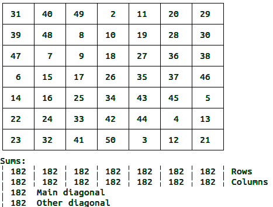

A magic square is a square array of positive integers arranged so that the sum of every row column and main diagonal is the same. This program generates a magic square after the user inputs the size of the grid and the magic number.

